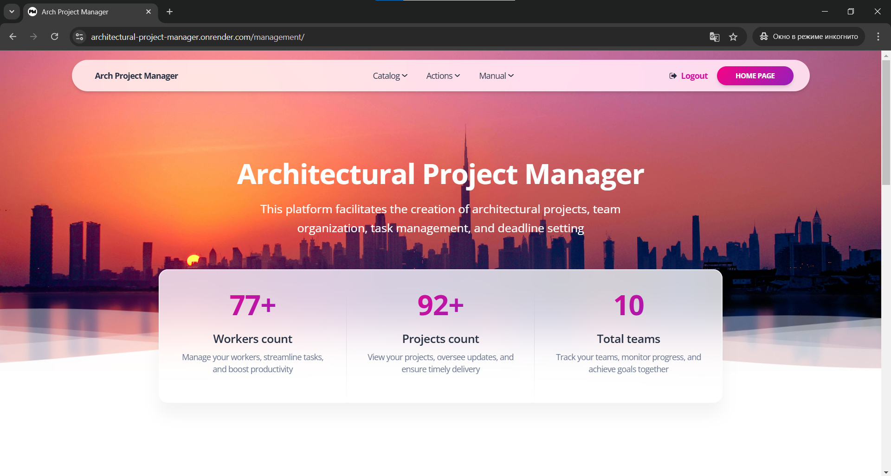

# Architectural Project Manager

## Project Description
**Architectural Project Manager** is a web application designed to manage architectural projects efficiently. It provides tools for managing positions, project types, workers, teams, and projects, ensuring a convenient interface for data storage and processing.

## Features
- **Data Management:** Add, edit, delete, and view information about positions, workers, teams, and projects.
- **Data Export and Import:** Supports working with JSON fixtures for testing or data migration.
- **Admin Interface:** Utilizes Django's built-in admin panel for easy data management.

## Check in out!

### [Architectural Project Manager deployed to Render](https://architectural-project-manager.onrender.com/management/)

## Technologies Used
- **Backend:** Django Framework
- **Frontend:** HTML, CSS (with Bootstrap for responsive design)
- **Database:** 
  - **Development:** SQLite (default for quick setup)
  - **Production:** PostgreSQL
- **Frontend Template:** A pre-built frontend template was customized and adapted to fit the project's needs, speeding up development and ensuring a professional design

## Installation
#### Python 3 must be already installed
1. Clone the repository:
   ```bash
   git clone https://github.com/danilsiv/architectural-project-manager.git
   cd architectural-project-manager
2. Create and activate a virtual environment:
   ```bash
   python -m venv venv
   source venv/bin/activate  # For Linux/Mac
   venv\Scripts\activate  # For Windows
3. Install dependencies:
    ```bash
   pip install -r requirements.txt
4. Apply database migrations:
    ```bash
   python manage.py migrate
5. Start the development server:
    ```bash
   python manage.py runserver
6. To load test data into the database, use the following command:
    ```bash
   python manage.py loaddata management/fixtures/data.json
   
### Default admin credentials:
- **Username:** test_user
- **Password:** passwordfortest
   
## Demo

   